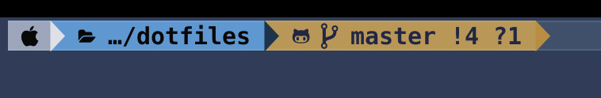
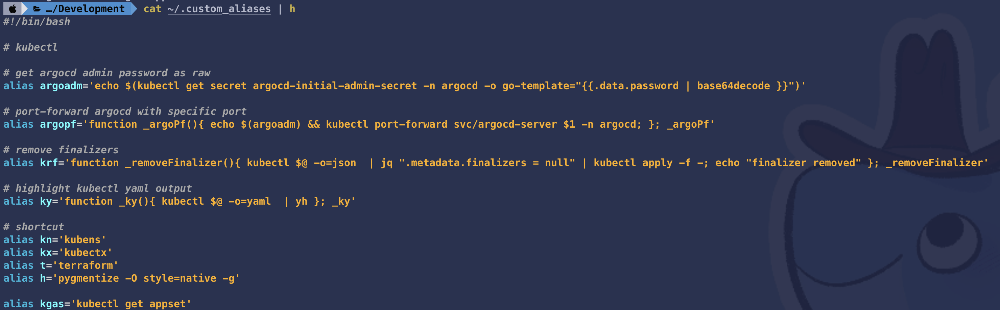

# my macOS Customizations

## Download & Install List

- Xcode
- Visual Studio Code
- iTerm2
- SourceTree
- Homebrew
- Zoom
- Slack
- Flux
- Stats
- Clipy
- Google Chrome
- `Meslo LG S DZ Regular for Powerline` font
- `Meslo LG S Bold for Powerline` font

## OS Settings

Download **Zyxel Wireless USB Adapter** [driver](https://www.tp-link.com/tr/support/download/tl-wn722n/). and install.


## Google Chrome extenions

Open `extensions.html` and download the list of extensions

## vscode Settings

- Install **Settings Sync** extension.
- Open **Settings Sync** extension, click **"Login with GitHub"** and login GitHub account.
- Then **"Select Your Existing Gist"** :
  - vscode.sync (`ed4f30ee3fc3378a2b61f1a78ed0d122`)
- Open View -> Command Palette ( Shift + Command + P) and Run **">Sync: Download Settings"**

### vscode-icons

- Move `vsicons-custom-icons` folder under to `~/`


## Installing software via Homebrew

All software installed on the system must be listed in `.Brewfile`. This is
symlinked at `~/.Brewfile` and used by `brew bundle`.

To install all the software, add it to `.Brewfile` and run:
```
mv ./Brewfile ~/.Brewfile
brew bundle --global
```
Some stuff will take long, in that case, identify which packages and update
`.Brewfile` to install them with `args: ['force-bottle']` or do a one-off
`brew install --force-bottle [pkg]` install.

## iTerm2 Settings

```
mv com.googlecode.iterm2.plist ~/Settings/iTerm2/
```

Open `iTerm2` and
    `Preferences` -> `Load Preferences` from `com.googlecode.iterm2.plist` directory.

Restart iTerm2.

## oh-my-zsh Settings

### Install

- [oh-my-zsh](https://github.com/ohmyzsh/ohmyzsh)
- [powerlevel9k theme for oh-my-zsh](https://github.com/Powerlevel9k/powerlevel9k/wiki/Install-Instructions#option-2-install-for-oh-my-zsh)
- [zsh-syntax-highlighting](https://github.com/zsh-users/zsh-syntax-highlighting/blob/master/INSTALL.md#oh-my-zsh)
- [zsh-autosuggestions](https://github.com/zsh-users/zsh-autosuggestions/blob/master/INSTALL.md#oh-my-zsh)

```shell
echo "POWERLEVEL9K_SHORTEN_DIR_LENGTH=1" >> ~/.oh-my-zsh/oh-my-zsh.sh
```



```shell
POWERLEVEL9K_SHORTEN_STRATEGY=default
POWERLEVEL9K_SHORTEN_DIR_LENGTH=1
POWERLEVEL9K_SHORTEN_DELIMITER='\u2026'
POWERLEVEL9K_DIR_FOREGROUND=232
POWERLEVEL9K_DIR_SHORTENED_FOREGROUND=232
```

## Create a SSH Key
  
```shell
ssh-keygen -t rsa
```

## Git Settings

```shell
git config --global user.name "Ali Can Kuştemur"
git config --global user.email "alican.kustemur@gmail.com"
git config --global credential.helper osxkeychain
```

## Tweaks

```shell
defaults write NSGlobalDomain AppleShowScrollBars -string "Always" # show scrollbar always
defaults write com.apple.finder AppleShowAllFiles true   # Show hidden files
defaults write com.apple.finder ShowStatusBar -bool true # Show Finder statusbar

# Default Finder location is the home folder
defaults write com.apple.finder NewWindowTarget -string "PfLo" && \
  defaults write com.apple.finder NewWindowTargetPath -string "file://${HOME}"

# disable smart quotes and dashes
defaults write 'Apple Global Domain' NSAutomaticDashSubstitutionEnabled 0
defaults write 'Apple Global Domain' NSAutomaticQuoteSubstitutionEnabled 0
defaults write 'Apple Global Domain' NSAutomaticPeriodSubstitutionEnabled 0


# change screenshot location
mkdir ~/Desktop/SS
defaults write com.apple.screencapture location ~/Desktop/SS
```

## Copy Files

Copy `.bash_profile`, `oh-my-zsh.sh` and `.zshrc` to `~/

## Installing software manually

- Download LastPass Browser Extensions and mac app


# Update .dotfiles

## Creating a Brewfile
You can dump a Brewfile of your current brew/cask/mas entries into your current directory with

```
brew bundle dump .
brew analytics off
```

## yh - YAML Highlighter

```shell
git clone https://github.com/alicankustemur/yh
cd yh
go build .
mv yh /usr/local/bin/
```

## Terminal Highlighting

```shell
pip3 install pygments
alias h='pygmentize -O style=native -g'
```



test
```
cat ~/.custom_aliases | h
```


